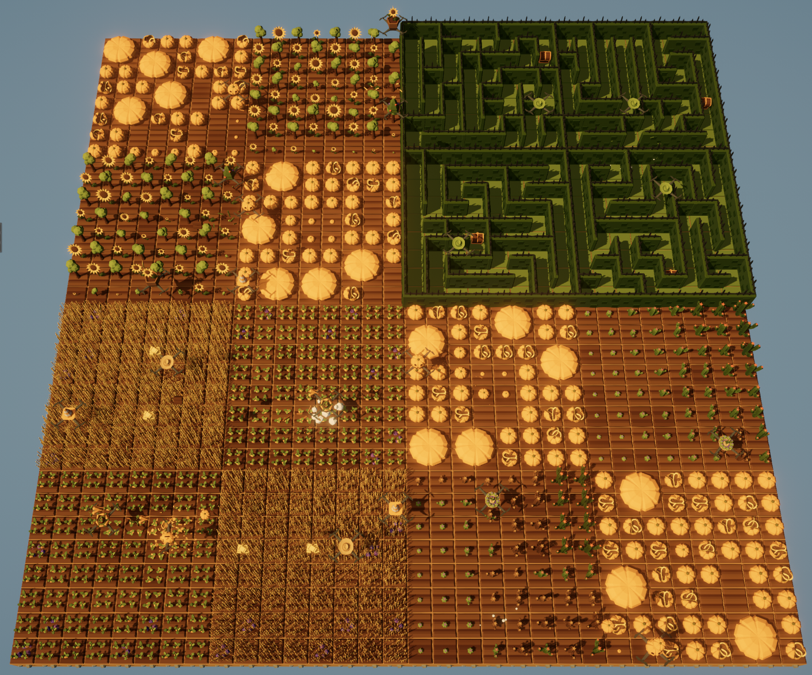

# TFWR Grid Setup

This project provides a grid setup for the game [The Farmer Was Replaced](https://store.steampowered.com/app/2060160/The_Farmer_Was_Replaced/) on Steam. It is designed to help automate the farm using a drone by predefining the layout of different farm goals.

## Overview

This branch setup is made for 22 drones.
The farm grid is divided into four quadrants, each quadrant is divided into four subquadrants, each serving a specific purpose:

1. **Maze Quadrant (4 Drones)**  
   - Split into four Maze subquadrants
   - Uses an oriented Depth-First Search (DFS) to generate a path that approaches the goal efficiently.

2. **Carrots & Hay Quadrant (6 Drones)**  
   - Split into four subquadrants:
      - Two subquadrants for Hay (2 Drones).
      - Two subquadrants for Carrots (2 Drones).
   - Watering Drone (1 Drone)
   - Fertilizing Drone: Fertilizes every fourth plant (1 Drone)

3. **Trees, Sunflowers & Pumpkin Quadrant (7 Drones)**  
   - Split into four subquadrants:
      - Two subquadrants for Pumpkins (2 Drones).
      - Two subquadrants for Trees and Sunflowers.
         - Even for Sunflowers (2 Drones)
         - Odd for Trees (2 Drones)
   - Watering Drone (1 Drone)

4. **Pumpkin & Cacti Quadrant (5 Drones)**  
   - Split into four subquadrants:
      - Two subquadrants for Pumpkin (2 Drones).
      - Two subquadrants for sorting Cacti (2 Drones).
   - Watering Drone (1 Drone)

## Notes

I am having difficulties implementing Dino Drone in this quadrant system as it seems to always wander off into the plantation. I simply use Dino Drone on a Full grid.

## Usage

Clone the repository and import into the game folder. Adjust the quadrants as needed to match your farm size or game objectives.

## Contributing

Feel free to submit pull requests for improved layouts, additional crop arrangements, or better pathfinding algorithms.
